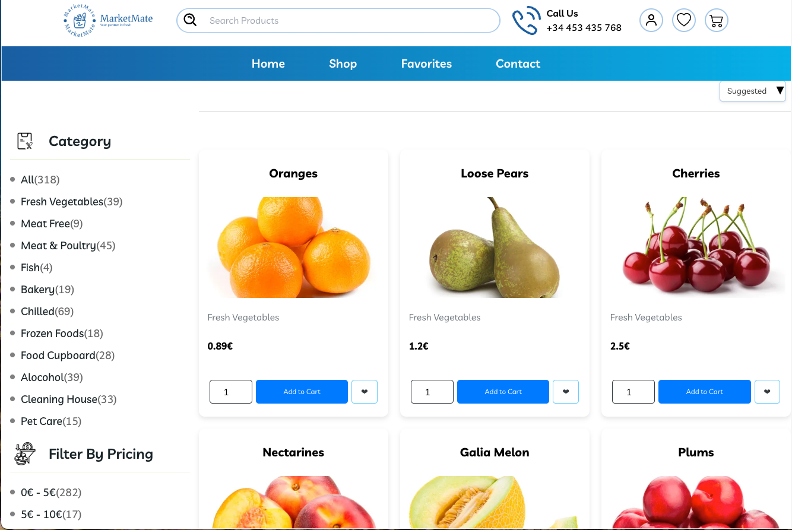
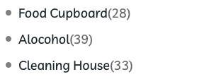
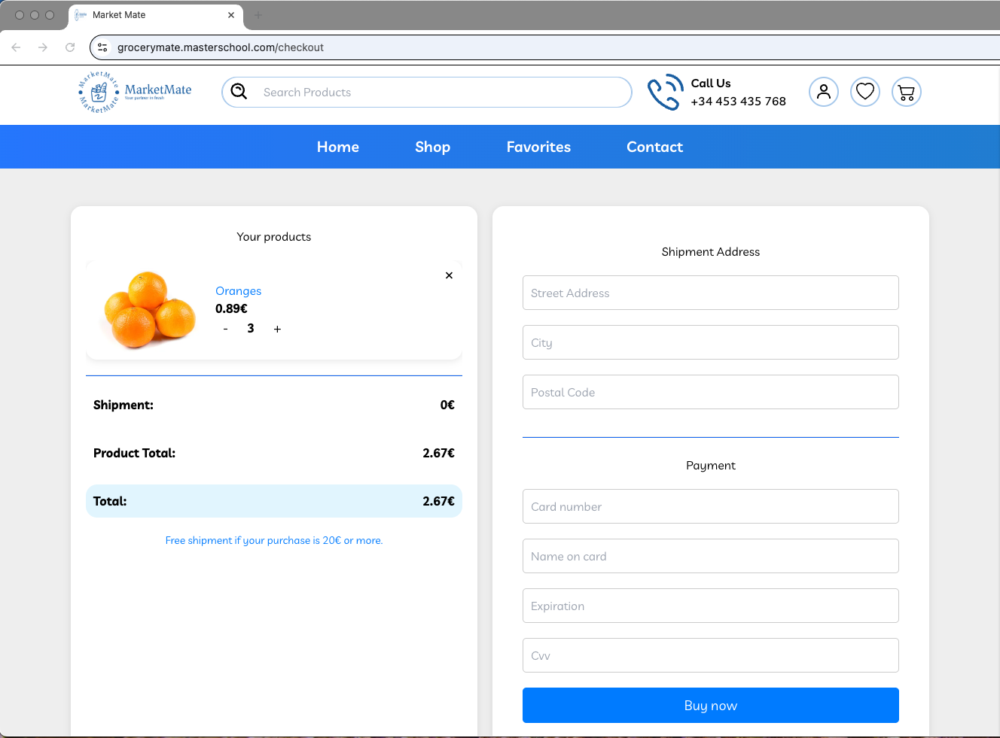
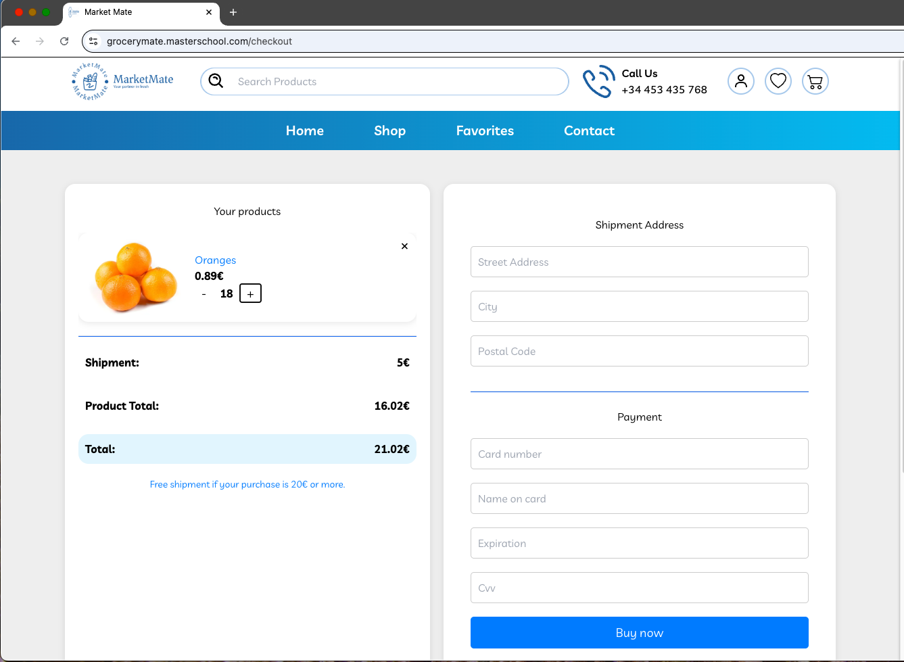
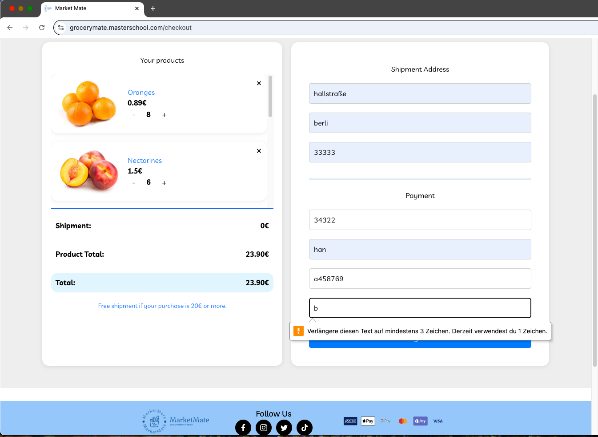

# Bekannte Probleme (Known Issues)

## 1. Falsche Schreibweise im Menü – "Alcohol" vs. "Alocohol"

**Beschreibung:**  
Der Menüpunkt für Alkoholprodukte war ursprünglich falsch als **"Alocohol"** geschrieben.  
Automatisierte Tests, die nach dem Text `Alcohol` gesucht haben, konnten das Element deshalb nicht finden.

**Auswirkung:**  
- Tests konnten den Button/Link nicht anklicken.  
- Fehler: `TimeoutException`, weil das Element nicht gefunden wurde.

**Lösung:**  
XPath und Selektoren wurden an die korrekte Schreibweise angepasst.

**Screenshot:**

## Free Shipment Bug
**Beschreibung:**  
Sobald der Warenwert einmal 20 € erreicht hat, werden die Versandkosten entfernt.  
Wenn anschließend Produkte entfernt werden und der Wert unter 20 € sinkt, werden die Versandkosten **nicht wieder hinzugefügt**.

**Schritte zum Reproduzieren:**
1. Produkte in den Warenkorb legen, bis der Gesamtwert über 20 € liegt.
2. Versandkosten fallen weg (Free shipment).
3. Produkte entfernen, sodass der Wert unter 20 € sinkt.

**Erwartetes Ergebnis:**
Versandkosten (5 €) sollten wieder angezeigt werden.

**Tatsächliches Ergebnis:**
Versandkosten bleiben entfernt, auch wenn der Wert unter 20 € fällt.

**Screenshot:**

**Status:** Offen

## Versandkosten-Bug bei 20 €

**Beschreibung:**  
Die Versandkosten werden nicht korrekt entfernt, wenn der Warenwert 20 € oder mehr erreicht.  
Laut Hinweis im Shop sollte ab 20 € die Lieferung kostenlos sein ("Free shipment if your purchase is 20€ or more.").

**Schritte zum Reproduzieren:**
1. Produkte in den Warenkorb legen, bis der Gesamtwert 20 € oder mehr beträgt.
2. Zum Checkout gehen.

**Erwartetes Ergebnis:**
Ab einem Warenwert von mindestens 20 € sollten die Versandkosten (5 €) automatisch entfernt werden.

**Tatsächliches Ergebnis:**
Die Versandkosten von 5 € bleiben bestehen, auch wenn der Gesamtwert über 20 € liegt.

**Screenshot:**

**Status:** Offen

## 1. Ungültige Kreditkartennummern werden akzeptiert
**Beschreibung:** 
Kreditkartennummern mit weniger als 16 Ziffern werden akzeptiert, obwohl diese ungültig sein sollten.
- 
**Erwartetes Verhalten:** 
Nur 16-stellige Kreditkartennummern (oder validierte Kartennummern per Luhn-Check) dürfen akzeptiert werden.

**Screenshot:**

**Status:** Offen

## 2. Ungültige Eingaben im Expiration-Feld
**Beschreibung:** 
Das Feld für das Ablaufdatum (Expiration) akzeptiert Buchstaben und andere ungültige Eingaben.

**Erwartetes Verhalten:** 
Das Feld sollte ausschließlich das Format `MM/YYYY` akzeptieren.

**Screenshot:**

**Status:** Offen

## 3. CVV-Feld akzeptiert ungültige Eingaben
**Beschreibung:** 
Das CVV-Feld akzeptiert Buchstaben.

**Erwartetes Verhalten:** 
Nur 3-stellige numerische Werte sollten akzeptiert werden.

**Screenshot:**

**Status:** Offen

**✳️Status:** **Offen**

## 4. Ungültige Kreditkartendaten werden als gültig verarbeitet

**Beschreibung:**  
Testfälle mit ungültigen Kreditkartendaten (z. B. zu kurze Kartennummer, ungültiges Ablaufdatum, Buchstaben im CVV) führen **trotzdem zur erfolgreichen Zahlung** und Anzeige der Bestellbestätigungsseite ("Fresh").

**Erwartetes Verhalten:**  
Das System sollte **nur** gültige Kreditkartendaten akzeptieren.  
Fehlerhafte Eingaben müssen erkannt und mit einer Fehlermeldung abgewiesen werden.  
Die Seite `Fresh` darf **nicht erscheinen**.

**Status:** **Offen**

## 5. Tests mit falscher Erwartung liefern Erfolg

**Beschreibung:**  
In der Datei `test_checkout_invalid_card.py` liefern **Test 2 und Test 4** ein **falsches Ergebnis**.  
Diese Tests verwenden ungültige Zahlungsdaten, erwarten korrekt ein Scheitern – das System akzeptiert jedoch die Zahlung.

| Test | Kartennummer           | Ablaufdatum | CVV  | Erwartet | Tatsächlich |
|------|-------------------------|-------------|------|----------|-------------|
| 2    | 1234 4546 2125 4847     | 12/2623     | abc  | ❌ Fail  | ✅ Erfolg   |
| 4    | 1234                    | 12/2656     | abc  | ❌ Fail  | ✅ Erfolg   |

**Erwartetes Verhalten:**  
Tests mit ungültigen Daten müssen korrekt **fehlschlagen** und dürfen **nicht** auf der Seite `Fresh` landen.

**Status:** **Offen**

